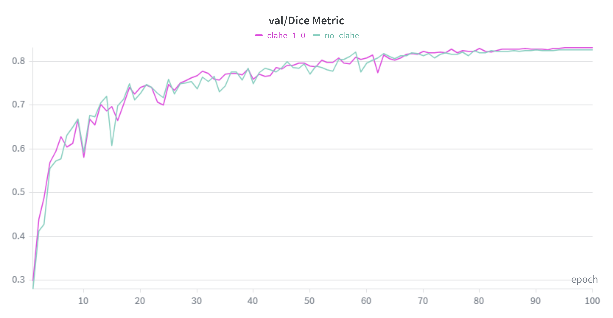
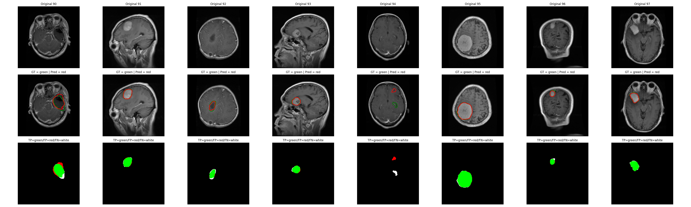
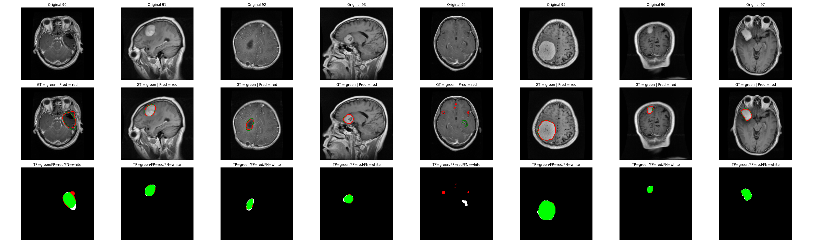

# U-Net implementation for 2D Brain Tumor Segmentation


This project implements a U-Net architecture for 2D brain tumor segmentation, including training and evaluation pipeline implemented with PyTorch.

For the data preprocessing, all images were resized to a fixed size, normalized with Z-score normalization, and optionally processed with CLAHE contrast enhancement. This project additionally evaluates the effect of applying CLAHE contrast enhancement on segmentation performance. Results of this experiment are available in the Results section below.

For this project a custom curriculum-based online data augmentation strategy was implemented using Albumentations. In this strategy augmentation intensity gradually increases during training. 

Segmentation performance is evaluated using Dice and IoU scores from torchmetrics, with additional segmentation visualization tools built in matplotlib. 

The experiments were tracked via Weights & Biases. 

The dataset used for training and evaluation is available on Kaggle:  
https://www.kaggle.com/datasets/nikhilroxtomar/brain-tumor-segmentation

---

## Key Features

* **Custom U-Net Architecture** – U-Net with Residual Blocks.
* **Custom Hybrid Loss Function** – Custom hybrid loss function combining BCE and Dice Loss.
* **Curriculum-based Data Augmentation** – Augmentation strength increases progressively during training.
* **Preprocessing Pipeline** – Resizing, Z-score normalization and optional CLAHE contrast enhancement.
* **Performance Metrics** – Dice and IoU scores computed using torchmetrics (`BinaryF1Score`, `BinaryJaccardIndex`).
* **Segmentation Visualization** – Visualization of predictions on validation samples after each epoch.
* **Experiment Tracking** – Integrated experiment tracking using Weights & Biases.
* **CLAHE Impact Analysis** – Assessment of CLAHE contrast enhancement impact on segmentation performance.
---

## Tech Stack

- **Core**: Python, PyTorch  
- **Computer Vision**: OpenCV, Albumentations  
- **Metrics**: torchmetrics  
- **Visualization**: matplotlib  
- **Experiment Tracking**: Weights & Biases  

---

## Results

The impact of contrast enhancement using CLAHE on segmentation performance was evaluated by comparing it against the same pipeline without the CLAHE preprocessing step. The results are reported as the best Dice and IoU scores achieved on the validation set. The results are presented in the table below.

| Preprocessing | Dice Score | IoU Score |
|---------------|------------|-----------|
| CLAHE         | 0.83188    | 0.71216   |
| Baseline      | 0.82761    | 0.70591   |

All training metrics were tracked using Weights & Biases, which enabled visualization of model performance. An example validation Dice score plot is presented below.

<p align="center">
  
</p>

*Comparison of Dice scores on the validation set for the baseline and CLAHE preprocessing.*

Additionaly, during training segmentation results on selected validation images were logged. Below are example plots for the baseline model and the model with CLAHE preprocessing.

<p align="center">
  
  
  
</p>

*Segmentation performance visualization on validation set samples for the baseline model and model with CLAHE preprocessing.*

---

## Project Structure

```text
UNet/
├── augmentations.py        # Curriculum-based online data augmentation pipeline (Albumentations)
├── clahe_preprocessor.py   # CLAHE contrast enhancement (optional preprocessing)
├── dataset.py              # Dataset class and data loading logic
├── logging_config.py       # Configuration for logging and experiment tracking
├── main.py                 # Main
├── metrics.py              # Metrics and loss functions (Dice, IoU, BCE-Dice)
├── normalizer.py           # Z-score normalization
├── train.py                # Training and validation loops
├── unet.py                 # U-Net model with residual blocks
├── vis_augmentation.py     # Visualization of data augmentation effects
├── vis_segmentation.py     # Visualization of segmentation predictions
├── wandb_logger.py         # Weights & Biases logging utilities
```

--- 

### Running the Project 
1. Open `U-Net.ipynb` in Google Colab and run all the cells. 

--- 

## License 
This project was made for educational purposes.